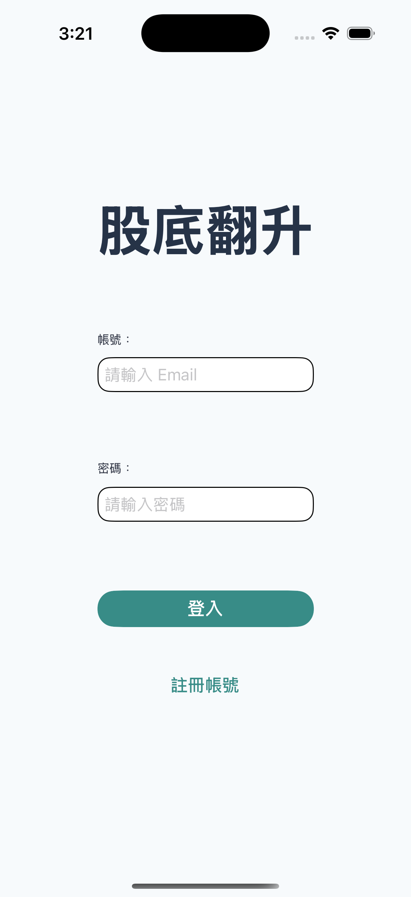
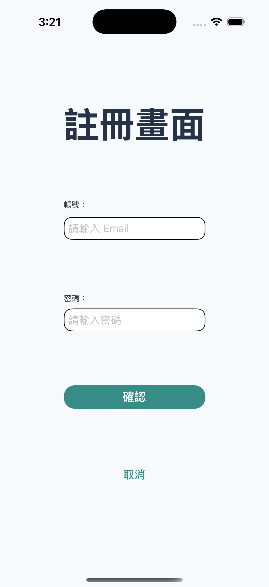
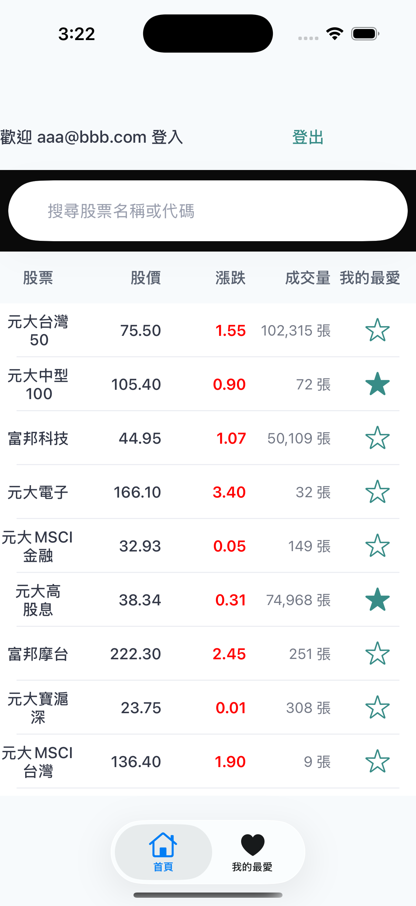
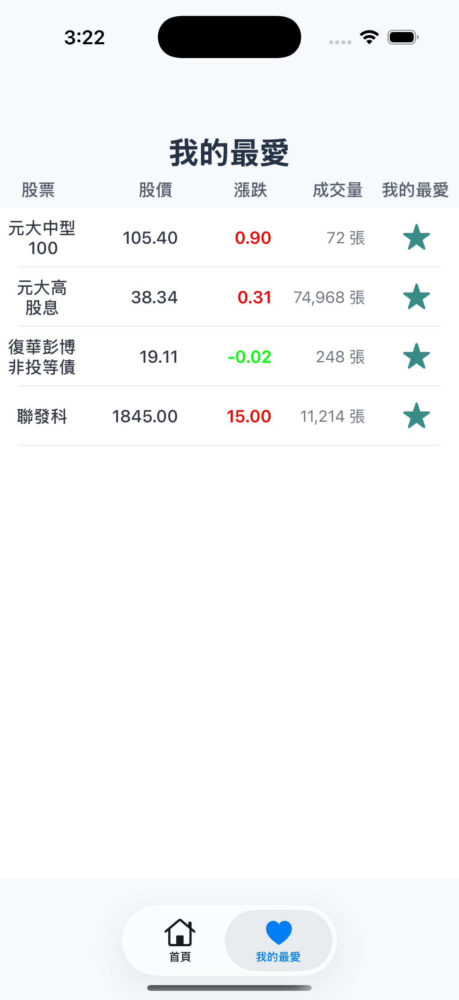
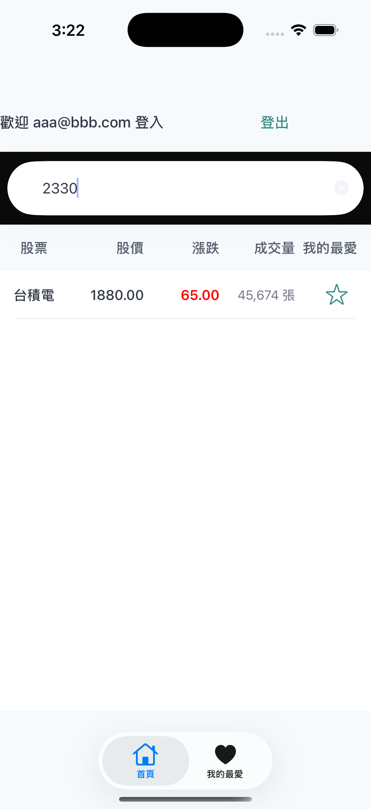
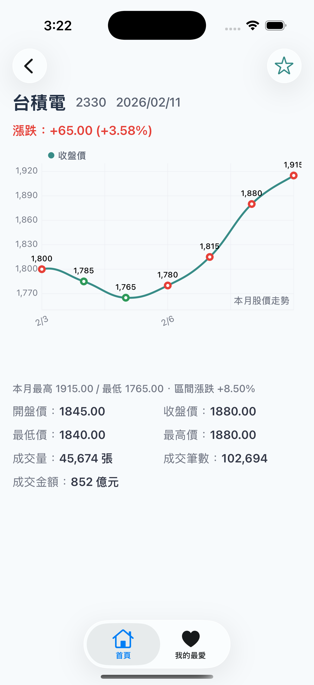

# Gudi - 股滴

一個使用 UIKit 開發的台灣股市資訊應用程式，提供即時行情、本月走勢圖、收藏清單與登入註冊等功能。

## 專案簡介

Gudi 是一個展示 MVC 架構的 iOS 示範專案，結合 Firebase 與台灣證券交易所開放 API，實現股票列表、詳情圖表、我的最愛與使用者認證的完整流程。

## 📸 應用程式截圖

| Gudi01 | Gudi02 |
| :---: | :---: |
|  |  |

| Gudi03 | Gudi04 |
| :---: | :---: |
|  |  |

| Gudi05 | Gudi06 |
| :---: | :---: |
|  |  |

## 主要功能

- **智能列表**：瀏覽當日全部個股行情（代碼、名稱、收盤價、漲跌、成交量），支援搜尋與收藏標記
- **股票詳情**：單檔開高低收、漲跌幅、本月股價走勢圖、區間最高/最低與漲跌%、成交金額與筆數
- **我的最愛**：將股票加入收藏，在「我的最愛」分頁快速查看（資料存於 Firebase Firestore）
- **登入 / 註冊**：使用 Firebase Authentication（Email 登入），區分登入前後體驗

## 專案架構

### 技術架構

- **MVC 模式**：分離 Model、View、Controller，搭配 Service 層處理網路與資料
- **UIKit + Storyboard**：以 Storyboard 管理畫面與導航
- **Firebase**：Authentication（登入註冊）、Firestore（收藏清單）
- **DGCharts**：本月股價折線圖與圖表樣式
- **台灣證券交易所 API**：當日全部個股、單檔當月歷史資料

### 檔案結構

```
Gudi/
├── Controller/                     # 畫面控制器
│   ├── HomeViewController.swift    # 首頁（股票列表）
│   ├── StockDetailViewController.swift  # 股票詳情（圖表、價格、成交量）
│   ├── FavoritesViewController.swift    # 我的最愛
│   ├── LoginViewController.swift  # 登入
│   └── RegisterViewController.swift     # 註冊
│
├── Model/                          # 資料模型
│   ├── StockViewModel.swift       # 當日行情（API 對應）
│   └── StockDailyRecord.swift     # 單日歷史紀錄（圖表用）
│
├── View/                           # UI
│   ├── Base.lproj/
│   │   ├── Main.storyboard        # 主畫面流程
│   │   └── LaunchScreen.storyboard
│   ├── StockTableViewCell.swift   # 列表 Cell
│   └── Assets.xcassets            # 圖片與色彩
│
├── Service/                        # 服務層
│   ├── StockService.swift         # 股市 API（列表、歷史）
│   └── FavoriteService.swift      # Firestore 收藏
│
├── Helpers/                        # 工具
│   └── StockChartBuilder.swift    # 折線圖資料組裝
│
└── Gudi/                           # App 入口與設定
    ├── AppDelegate.swift
    ├── SceneDelegate.swift
    ├── Info.plist
    └── GoogleService-Info.plist    # Firebase 設定
```

## 使用流程

1. **首頁 (.home)**  
   進入後載入當日全部個股，可搜尋、點擊進入詳情、點星號加入/移除收藏。

2. **股票詳情**  
   顯示該檔開盤/收盤/最高/最低、漲跌與漲跌幅、本月股價走勢圖、區間最高/最低與漲跌%、成交量與成交金額與筆數；可於詳情頁加入我的最愛。

3. **我的最愛**  
   僅顯示已收藏股票（需登入），資料與 Firebase Firestore 同步。

4. **登入 / 註冊**  
   使用 Email 註冊與登入，登入後可使用「我的最愛」並同步至雲端。

## 設計模式

### MVC + Service 層

- **Model**：`StockViewModel`、`StockDailyRecord` 等資料結構與 API 回應對應。
- **View**：Storyboard、`StockTableViewCell`、圖表由 DGCharts 繪製。
- **Controller**：各 ViewController 負責畫面邏輯、呼叫 Service、更新 UI。
- **Service**：`StockService`（TWSE API）、`FavoriteService`（Firestore），與 Controller 分離。

### 資料來源（API）

- 當日全部個股：`https://openapi.twse.com.tw/v1/exchangeReport/STOCK_DAY_ALL`
- 單檔當月歷史：`https://www.twse.com.tw/exchangeReport/STOCK_DAY?response=json&date=...&stockNo=...`

## 授權

此專案為個人 Side Project，僅供學習與作品集展示用途。

---

👤 **作者**  
Created by kai
